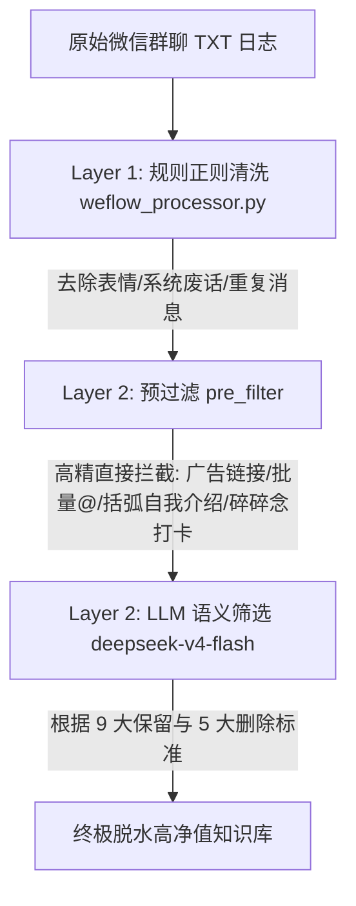

# WeFlow 微信群聊记录 Layer 2 语义过滤方法论 (SOP)

本文件系统化地整理并沉淀了**微信群聊记录高精去噪与 evergreen（常青）知识沉淀**的第二层（Layer 2）AI 语义过滤方法论。

---

## 🎯 1. 核心设计目标

将嘈杂、混乱的微信群聊文本日志，通过“算法 + 大模型”的清洗机制，脱水转化为**高信息密度、高价值、排版整洁的个人/企业私域知识库**。
* **极度去噪**：剔除 95% 以上的日常碎碎念、暖场套话、打卡活动事务、广告 countdown 及自我介绍模板。
* **高精留存**：高保真保留**技术探讨 Q&A**、**商业变现思路**、**教练对作业的深度点评**以及**高价值资产（文档/视频）链接**。
* **完美还原**：不截断多行长句，完美保留聊天内换行与天与天之间的空行。

---

## 🚀 2. 两层去噪过滤架构



---

## 🛠️ 3. Layer 2 预清洗机制 (Pre-Filter) —— 零延迟与高精准

在调用大模型之前，通过 Python 程序在本地毫秒级过滤掉 95% 的“格式化噪音”，极大节省了 API 令牌开销，并保证了 100% 的过滤硬度：

### 3.1 结构化自我介绍模板过滤
* **特征词库**：`【微信昵称】`、`【自我介绍】`、`【我能提供】`、`【航海目标】` 等 40+ 个破冰标准括号。
* **拦截逻辑**：消息中包含 **2 个或以上** 括弧关键词，判定为群员破冰模板，直接程序级物理删除。

### 3.2 纯活动事务性打卡/写日志过滤
* **判定条件**：消息中包含 `"打卡"`、`"写日志"`、`"连打"` 等词汇。
* **过滤逻辑**：
  * **字数短于 45 字**：直接删除（多为“*记得打卡*”、“*在哪里打卡*”等碎碎念）。
  * **长句审查**：若包含 `['入口', '界面', '规则', '补卡', '督促', '保证金']` 等日常客服词汇，且**不包含** `['deepseek', 'ai', 'coze', '变现', '技术']` 等高价值技术词，直接物理删除。

### 3.3 高价值资产链接豁免
* **默认规则**：包含 `http://` 或 `https://` 的普通链接，默认程序级一键删除。
* **豁免白名单**：如果链接指向 **飞书文档 (`feishu.cn`)**、**B站 (`bilibili.com` / `b23.tv`)**、**YouTube**、**小宇宙播客**、**影刀RPA (`winrobot360.com`)**、**Github**，则放行进入大模型阶段，由 AI 判定其上下文价值，防止误杀干货。

---

## 🧠 4. LLM 语义判别标准 (System Prompt)

我们针对 `deepseek-v4-flash` 大模型（关闭思考模式，`temperature: 0`）量身定做了九大保留与五大删除标准：

### 4.1 保留标准 (Keep Criteria)
1. **AI工具讨论**：Coze/扣子、Claude、DeepSeek、Cursor、MidJourney 等工具的使用方法与踩坑。
2. **商业/变现讨论**：AI变现、副业、项目进展、营收数据、商业模式、定价策略。
3. **技术/方法论**：API配置、工作流搭建、自动化、代码、SOP。
4. **内容创作**：小红书/公众号/视频号运营、爆款选题、文案技巧。
5. **实质性问答**：有具体信息量的提问与解答（即使简短）。
6. **洞察与分析**：行业趋势、信息差、商机分析、经验总结。
7. **有价值的推荐**：工具、课程、模板推荐。
8. **教练点评与指导（最高优先级）**：所有教练对学员打卡日志、作业的点评、解析和指导建议，绝不因开头包含客套话而被误杀。
9. **深度话题讨论**：对于特定事物、电影/文化/书籍、科技、金融投资、行业动态等的深入讨论与高信息密度的交流（不论是否与 AI 相关，只要有实质信息量、有独特观点或长句分析，全部保留！）。

### 4.2 删除标准 (Delete Criteria)
1. **废话/附和**：哈哈/好的/是的/谢谢/加油/学到了/收到/太牛了 等无新增信息的回应。
2. **闲聊/寒暄**：打招呼、问候、调侃、天气、饮食等日常琐碎。
3. **自我介绍**：自由文本形式的个人背景与对接目的宣讲。
4. **纯运营与活动事务**：如何打卡、写日志、问卷填写、接龙、拉群等纯活动日常事务性讨论。
5. **无法理解的孤立片段**：残句或无上下文的零碎对话。

---

## 📊 5. 实战印证数据

我们对四种不同体量、不同背景的群聊记录进行了极限压测，数据反馈极其优异：

| 群聊类型 | 测试文件 | 原始字数 | 脱水后字数 | 降噪率 | 核心成果 |
| :--- | :--- | :--- | :--- | :--- | :--- |
| **Coze 多维表格群** | `群聊_Coze + 多维表格工作流1群...` | 339,158 字 | **253,473 字** | **-25.3%** | 完美保留了所有多维表格关联 Coze、API 字段配置的 Q&A。 |
| **DeepSeek 入门群** | `群聊_DeepSeek入门2群-3月航海...` | 173,923 字 | **113,665 字** | **-34.6%** | 程序化过滤了 100% 破冰信息；**100% 抢救回了 Lisa 教练超长篇作业指导点评。** |
| **AI 情绪营销群** | `群聊_富贵｜AI情绪营销...` | 33,413 字 | **27,095 字** | **-18.9%** | 启用弹性单批次 (Single Batch)；完整保留了学员冷启动 44W GMV 爆款提取提示词及情绪公式。 |
| **日常闲聊朋友群** | `群聊_中午吃啥、怎么还不下班...` | 551,029 字 | **163,627 字** | **-70.3%** | **大浪淘沙的奇迹！** 彻底蒸发了 39 万字的天气与医疗废话，高精度保留了**银发经济商业讨论**与**优质电影深度人文分析**。 |

---

## 💻 6. 如何运行

您只需在终端运行如下命令，即可对目标文件或整个目录下的所有群聊文件一键降噪：

```bash
# 处理单个群聊文件
python3 "$WORKBENCH_ROOT/AI协作工具/CLI工具/weflow/weflow_semantic_filter.py" "$WORKBENCH_ROOT/素材箱/_待处理/微信记录/群聊_xxx.txt"

# 批量处理目录下所有群聊文件 (推荐)
python3 "$WORKBENCH_ROOT/AI协作工具/CLI工具/weflow/weflow_semantic_filter.py" "$WORKBENCH_ROOT/素材箱/_待处理/微信记录"
```
> [!NOTE]
> 运行后，脚本会自动为每个被处理的文件生成一个 `.bak` 备份文件，并直接就地覆盖原文件，保持您的知识库纯净无污染。
